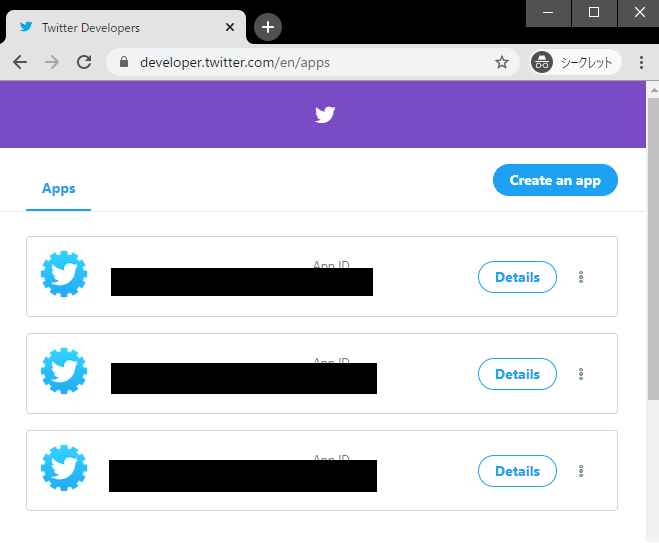
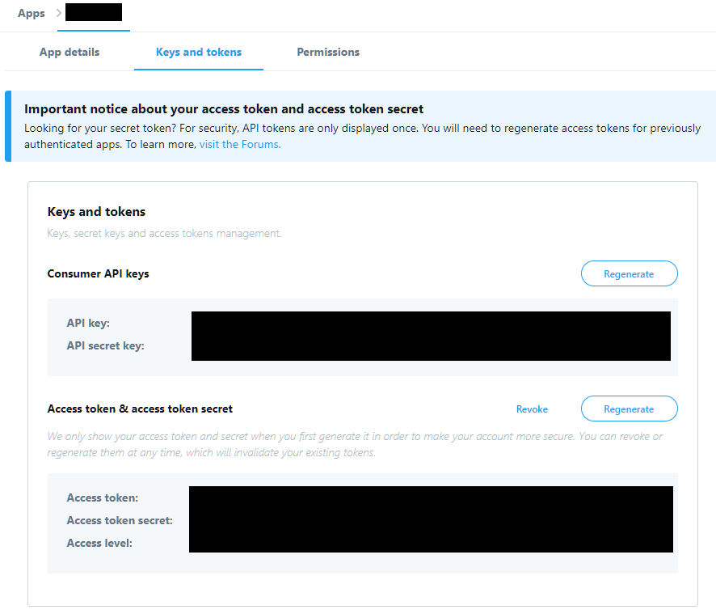

# 自動イラスト閲覧アプリ

## ローカル環境での実行
0. 環境 : Windows 10 Pro

1. リポジトリをダウンロードする。
```
git clone https://github.com/wakadorimk2/VueApplication
```

2. Twitterアカウントのトークンを取得する。
   1. Twitterアカウントを用意する。(API上限行くと制限を食らうので、別アカがおすすめ。)
   2. [Twitter Developer](https://developer.twitter.com/en/apps)にアクセスする。
   3. ```Create an app```でアプリを作成し、```Details```でアプリ詳細を表示する。
      |  |
      | :-: |
      | トークンの準備 |
   4. 作成したアプリのトークン4つを取得する。
      - API key
      - API secret key
      - Access token
      - Access token secret

      |  |
      | :-: |
      | Twitterアカウントのトークン |

3. ```server/conf_secret.py```を作成し、トークンを入力する。
```
keys_and_tokens = {
    'consumer_key' : '[API key]',
    'consumer_secret' : '[API secret key]',
    'access_token_key' : '[Access token]',
    'access_token_secret' : '[Access token secret]',
}
```

4. ライブラリのインストール
   1. npmとVue CLIをインストールする。
   2. Vue.jsライブラリをインストールする。
      ```
      cd vue
      npm install
      ```
   3. Pythonライブラリをインストールする。
      ```
      cd server
      pip install -r requirements.txt
      ```

5. 実行
   1. Pythonサーバを起動する。
      ```
      cd server
      python server.py
      ```
   2. Vue.jsクライアントを起動する。
      ```
      cd vue
      npm run serve
      ```


# 参考
- Developing a Single Page App with Flask and Vue.js | TestDriven.io https://testdriven.io/blog/developing-a-single-page-app-with-flask-and-vuejs/

- [Vue.js を vue-cli を使ってシンプルにはじめてみる - Qiita](https://qiita.com/567000/items/dde495d6a8ad1c25fa43)

- [imlinus/vue-magic-grid: ??♂?? Responsive Magic Grid for Vue](https://github.com/imlinus/vue-magic-grid)

- [HTML/CSSの覚え方　WEB制作に役立つ便利なチートシートまとめ - Minimal Green](https://www.atmarkit.co.jp/fdotnet/chushin/cheatsheet_02/cheatsheet_02_01.html)  

- [TwitterのAPI制限 [2019/11/17現在] - Qiita](https://qiita.com/mpyw/items/32d44a063389236c0a65)  
```/favorites/list```は15分当たり75リクエスト(=5[リクエスト/分])の制限があるので可能な限りキャッシングする。また1リクエストで1〜200ツイートを取得できるので、常に最大の200ツイートを取得することでRate Limitを避ける。

- [【Twitter】アクセストークン取得までの流れ - Qiita](https://qiita.com/kiyocy24/items/833280f2536b1d3ea41e)